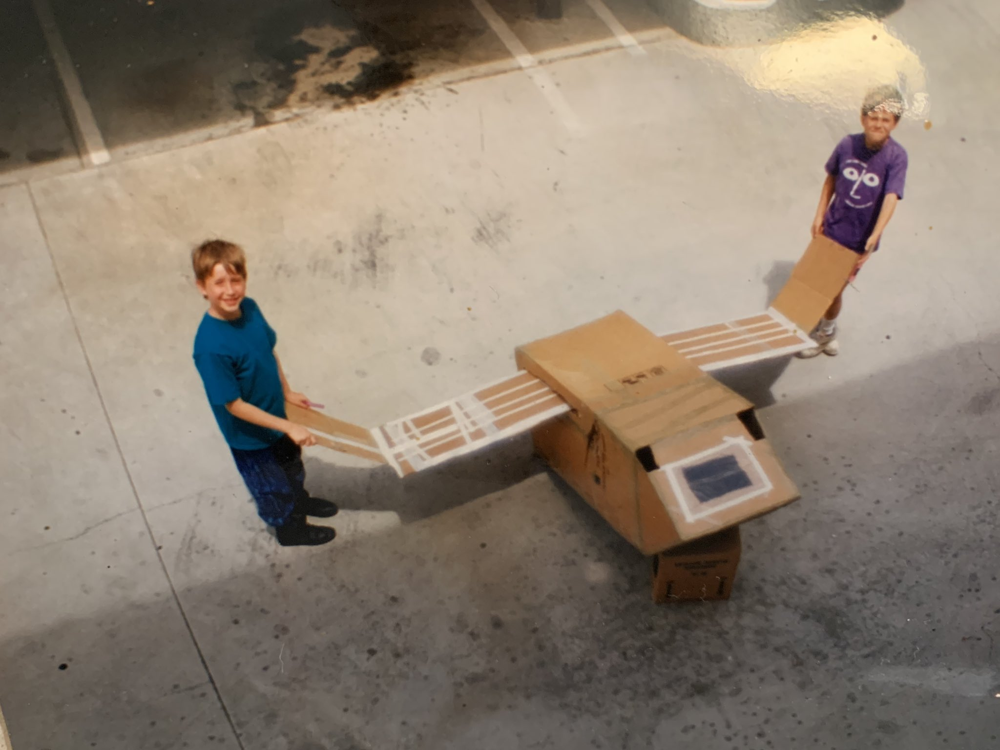

## Daycare

### Bum's Trail

A friend and I transcribed the entire Apple II floppy disk software for Oregon Trail into a spiral notebook, made modifications to it, and typed it all back into the Commodore 64 at the daycare center.  We called it Bum's Trail.

We also made an airplane.  It flew one time.

### Prime Number Generator

I developed a prime number generator in BASIC as one of my first programs.  It sieved up to 7 and optimized the search for factors by stopping at the square root and only testing odd numbers that made it through the sieve.

### Block Forts

I also built massive block forts:

And I was married in a fake ceremony at 7 years old, though I'm still not really married today. :)

## Middle School

### AppleScript Escapes at the Computer Lab

I helped out at the school computer lab, which had security software installed on it to prevent people from installing applications.  I found you could get around it by writing code in AppleScript that was not restricted by the security software.

### Polymorphic Encrypted Macro Viruses in Microsoft Word VBA

I had an 386SX IBM PC at home with a turbo button on the front, and a 56k dial-up modem.  Life was good.  Searching around on the early web, I got really into the Zine scene and learned about Microsoft Office Word macro viruses.  Following the guides from the Zines, I developed polymorphic, encrypted macro viruses as a hobby.

The most memorable result of this aside from infecting school friends for fun, was when we had a History class project.  The class was split into "countries" of 4 students, and we could turn in assignments to get power points for our country.  At the end of the semester, the countries would go to war not knowing eachothers' point totals.  If we attacked a stronger country unknowingly we would lose.  To collect intel, I installed a Microsoft Word trojan that would make copies of all of the assignments printed on the class computer.  So, by the end of the semester I had a very good idea which teams were the weakest.  Our country rapidly gobbled up the smallest countries and was on a roll to dominating the room.  The two remaining countries formed an alliance to defeat us by a narrow margin.

### NetNibbles (VB6)

I developed an online multiplayer version of the Snakes game called NetNibbles in VB6 using UDP sockets.

## High School

### TI-82

In high school, I was the kid walking around campus keeping to himself constantly tapping on my TI-82 calculator writing TI-BASIC code.  I developed a Nibbles snake game in text mode, Solitaire clone, AI chat bot (Very Slow), and a Triangle Solver application I used to speed through geometry tests.

### SubSpace : MERVBot

I got really into an online multiplayer game called VIE SubSpace, which also had a healthy reverse-engineering scene.  The SubSpace community was supported by [PriitK](https://en.wikipedia.org/wiki/Priit_Kasesalu) who was a talented C++ software developer from Estonia, who rewrote the server and client software so that it could continue being played.

I worked with another hacker I only know as Coconut Emulator, to develop a game-hosting bot supporting plugins for SubSpace called 

This was my first medium sized C++ project and was about the time that I learned about memory safety bugs. ;)

I stopped maintaining the software shortly after I went off to college, and the community has since continued hosting the bot site: http://www.mervbot.com/

Also found that someone has cloned the code to GitHub so it's forked here: https://github.com/catid/ssbot

### SubSpace : Game Client

I almost failed AP Physics in high school, because I was constantly focused on programming on my TI-82 and at home I was busy writing my own game client for SubSpace in DirectX 9 using C++.  The professor amended my grade based on my class final project, where I brought in a laptop with my SubSpace game client installed.  I derived the equations for time-stepped gravity simulation and flew my little 2D ship around a wormhole, bouncing bullets off walls and somehow saved my grade.

### SubSpace : Hacks

For fun, I found flaws in the software used for hosting the games, allowing me to read administrator passwords as those accounts logged in.  I also found ways to fake messages from other users and other fun hacks.  This enabled me to take over most of the SubSpace game servers on a whim.  A similar bug was used to attack the closely guarded closed-source software written by PriitK to host the main game servers, which I believe has been the only successful attack on those servers.  PriitK was pissed, and it was a hilarious time.

## Education

I was pretty focused on my BSEE degree in college at the FSU College of Engineering, which was off the main campus by a bike ride, graduating Magna Cum Laude on a scholarship.  I went on to complete my Master's degree in Electrical Engineering at Georgia Tech as well.

### GunBound : Proxy

One summer I took the time to do more game hacking back home.  I used [SoftICE](https://en.wikipedia.org/wiki/SoftICE) with an anti-debugger addon to step through the protected netcode of the GunBound application.  After stepping back from the `!ws2.recvfrom` calls to the decryption routines, I decided it was too much to do by hand.  So I cracked open the Intel Assembly Code manual and learned how to decode x86 machine code instructions to assembly code.  I coded up a tool called `Dismembler` that would read machine code from the game process, and write equivalent C++ code.  It only supported enough opcodes to do the job.  But soon I had my own version of their encryption and decryption routines and the static tables required.  It turned out to be a slightly modified version of AES.

After re-implementing their encryption code in C++, I wrote a proxy that sat between the game and the server.  I analyzed the protocol and found lots of opportunities to have some fun.  By the end of the summer, I was able to grant myself all of the gear in the game (including hidden items), crash clients of other users in the game channel, wipe high scores of other players, and generally have a blast.

For example, I found that I could send my game client the "it's your turn" packet to allow my character to move.  Normally GunBound is a turn-based game, but using this simple trick I was able to move constantly while other players were stuck in freeze-frame waiting for their turn.

One time while dominating players with my god-like game hacking powers, I noticed another player who wouldn't die.  No matter how many times I damaged their character it wouldn't take damage.  The only way to kill them was to "bunge" them by dropping all the terrain under them until they fell off the map.  This turned out to be Aaerox, a talented game hacker well known in the World of Warcraft (banned for life) and Infantry games.  Infantry was a game designed by the same team that worked on SubSpace.  So, the two of us started hanging out online and are still chatting to this day.

### World of Warcraft

Turns out, WoW ran on WINE in Linux.  I modified the WINE code so that GetTickCount() would tick faster if I held down the Tilda (`) character.  This allowed me to trivially speed around the game world when needed.  Helped out a lot in raids too.

Following on from my success hacking GunBound, I wrote a proxy for WoW as well.  I found that the packet encryption was extremely weak.  Each packet was encrypted by XORing the same 16 byte random sequence into all message data.  So instead of bypassing the login, I used a known-plaintext attack against the XOR encryption recover the random sequence and allow me to bypass the encryption.  I didn't do much to WoW because I enjoyed playing the game a lot, raiding through Wrath of the Lich King.  But I did take the time to write a fishing bot using the proxy so that I wouldn't need to manually fish.

Two nice features of proxy game hacks is that they cannot be detected, since the application doesn't run on the same computer as the game and cannot be scanned for in memory, and they often expose poor software practices of the developers who are often rushing to get something out the door.

### Startups

After moving to California, I've put my game hacking days behind me.  Lots of fond memories.  I'd totally recommend getting into this as a hobby.

Since then, I've bootstrapped myself as a hard-working startup software engineer with a penchant for rock climbing.  My first startup employer was [Game Closure](https://www.gameclosure.com/), 6 years before it became worth $1 billion.  I then joined up with Oculus, which was sold to Facebook for $2.5 billion.  I wrote most of the non-graphical backend software powering the Oculus Rift on the Windows PC platform, like the installer, firmware updater, hardware abstraction layer, inter-process communication, etc.  The [book about Oculus](https://www.amazon.com/History-Future-Facebook-Revolution-Virtual/dp/0062455966) is worth a read.  I'm currently leading the Video team at [Anduril Industries](https://www.anduril.com/), which is now worth $1.9 billion.
