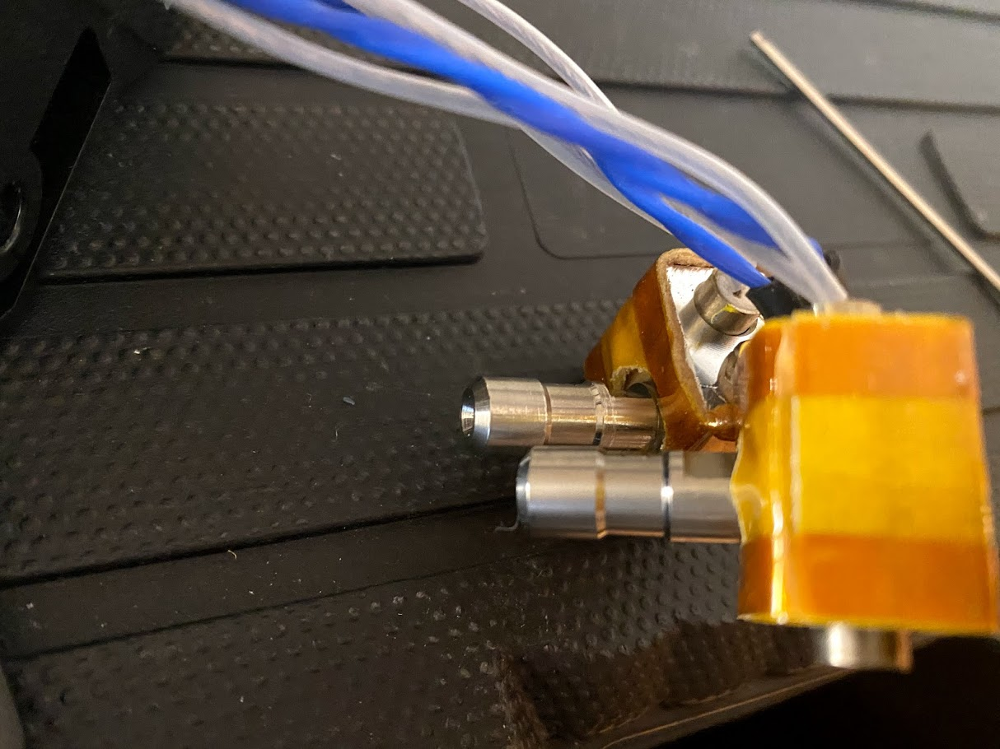
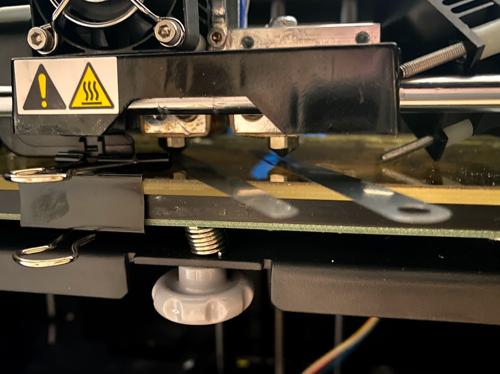
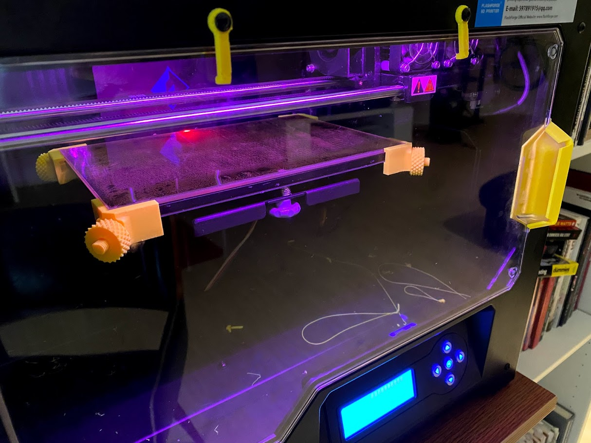
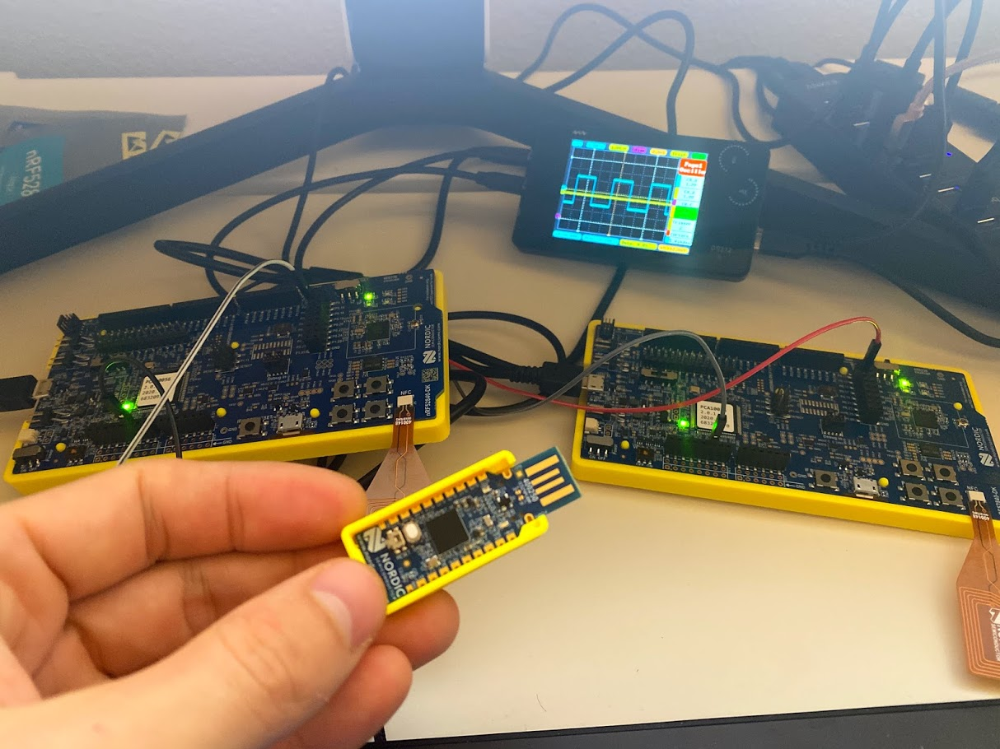
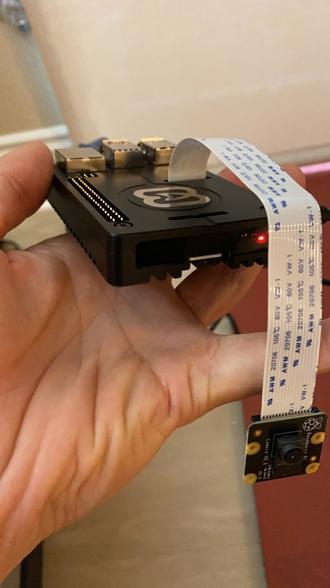
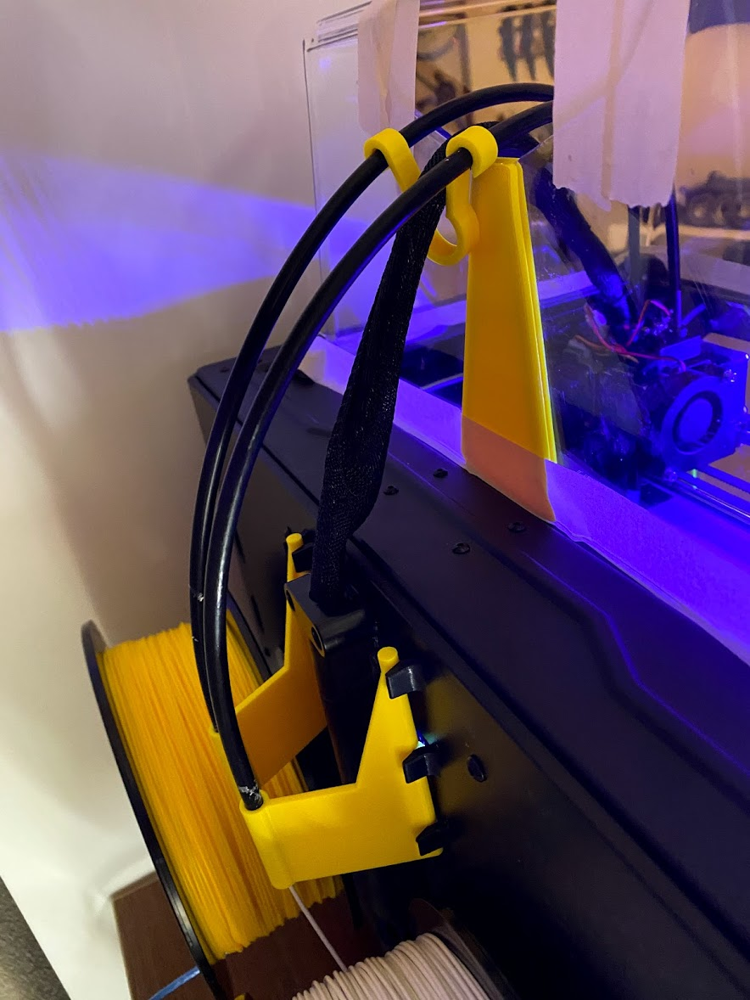
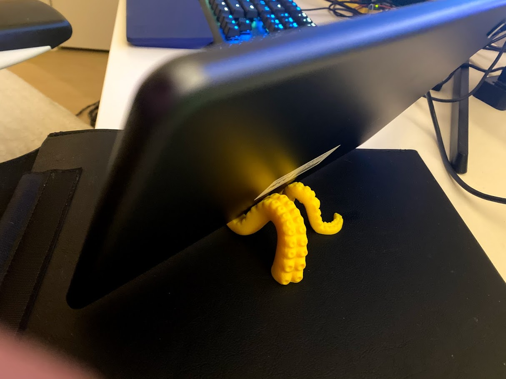
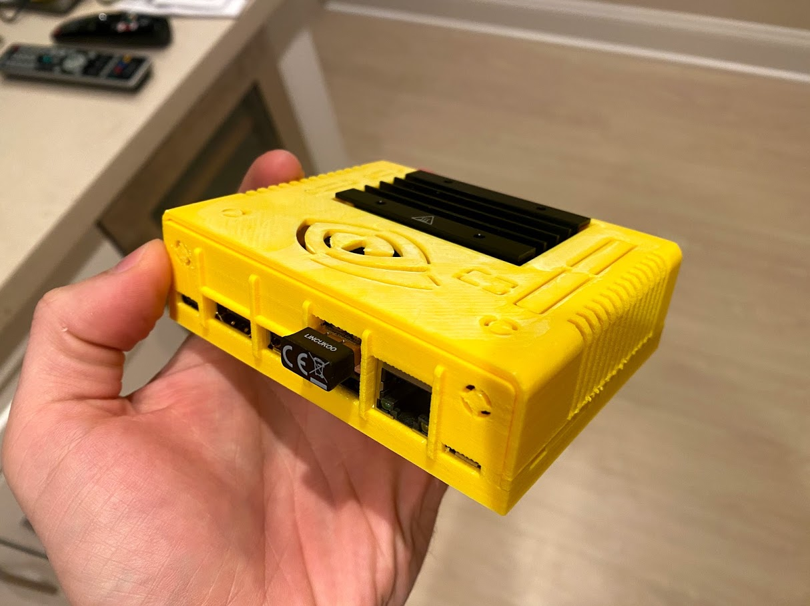

## My First 3D Printer (aww so cute)

I've decided to work on my own hobby electronics cases for the Jetson Nano and nRF52840 dongle.

It's time to learn how to do 3D printing and CAD modeling!

I found an excellent summary of [FDM filament properties](https://www.simplify3d.com/support/materials-guide/properties-table/) on the Simplify3D website.  I was looking for something that would work well outdoors and survive drops from 6 feet.  It looks like ASA is the only option.  To print with ASA (and ABS) it's essential to have an all-metal hotend so the extruders can run hotter more safely, and to have a PEI bed, and to have an enclosure to maintain temperature stability and contain toxic fumes.

ASA is a newer filament than ABS and it is very limited in color selection.  I can only find white, black, and blue colors from a few reputable vendors.  ABS has many more colors available.  It is safe to pour coffee into an ABS mug, but [not an ASA mug](https://formlabs.com/blog/guide-to-food-safe-3d-printing/).

The printer I chose was the FlashForge Creator Pro (2016).  This is a bit older, but it has plenty of modern features like an enclosure for keeping a high ambient temperature while printing, clearly designed for printing ABS so it works with ASA filament also.  The printer supports 0.1 mm layer height with a 0.4 mm nozzle, yielding high quality prints.  Since it's older, the price was really nice at under $700 pre-assembled and ready to go.  Instant shipping from Amazon was a huge plus too.

All that said, the Prusa i3 MK3S+ is the correct choice for 3D printer right now and I've ordered one of those also to improve my print speed.  The Creator Pro is also still a very good machine with lots of community support and upgrades available as I found out.

The Creator Pro can print in two colors:


I upgraded both of my hotends using [Micro Swiss MK10 All Metal Hotend Kit .4mm Nozzle for WANHAO, FlashForge](https://www.amazon.com/dp/B01C3HEQZC/).  This was a process.  I had to pull the whole extruder assembly apart and put it all back together:



And then making sure both extruders were exactly level within 0.1 mm was a huge pain with lots of false attempts:



The bed is upgraded with a borosilicate glass sheet with a PEI sheet on top.  The bed attaches to the printer using some (really cool) printed clips, allowing it to be removed from the printer and replaced easily.  In theory I can have a second glass bed that can be swapped in while I wait for the previous print to cool.

For cleaning I have only needed shop cloth and 99.9% IPA.

ABS prints stick really well to the bed and don't curl while printing and can be removed easily with appropriate tools.



Simplify3D turns out to be an expensive but worthwhile upgrade over open-source software, yielding significantly better and faster prints.  In one case I saved over 2 hours in a print just by switching from Cura to Simplify3D on the same model, with much better results.


## My first Thing

I've been able to tune the Simplify3D settings for the Creator Pro to produce a lot of electronics enclosures with IC3D ABS filament at high quality.

My first Thing on Thingiverse is a case for the `nRF52840-DK`: https://www.thingiverse.com/thing:4702374




## OctoPrint

I had a bunch of Raspberry Pis around the house from working on my [Pi KVM project](http://github.com/catid/kvm) and [Pi LoRa FTP project](https://github.com/catid/loraftp).  Turns out with the [GPX plugin](https://plugins.octoprint.org/plugins/gpx/) for OctoPrint you can print efficiently over the network on the Creator Pro.




## Simplify3D Process Settings

### Extruder

`Material`: `ABS`
`Print Quality`: `High`
`Extrusion Multiplier`: `1.00`
`Extrusion Width`: `0.40 mm`

### Layer

`Primary Extruder`: `Right Extruder`
`Primary Layer Height`: `0.1 mm`
`Top Solid Layers`: `5`
`Bottom Solid Layers`: `4`
`Outline Shells`: `2`
`Outline Direction`: `Inside-Out`

`First Layer Height`: `100%`
`First Layer Width`: `100%`
`First Layer Speed`: `20%`

### Additions

None!  These are a pain to peel off with ABS/ASA so I got my prints working well and disabled them.

### Infill

`Internal Fill Pattern`: `Rectilinear`
`External Fill Pattern`: `Rectilinear`

These turned out to be better than other options.

`Interior Fill Percentage`: `30%`
`Outline Overlap`: `40%`
`Infill Extrusion Width`: `100%`
`Combine Infill Every`: `2 layers`

### Support

`Generate Support Material`: `Yes!`

This is needed on a lot of cases because of vertical windows in the sides for ports.

`Combine Support Every`: `2 Layers`

### Temperature

`Heated Build Platform`: `100C`

Before installing the glass bed, I had to use a higher 105C temperature, but after installing the glass bed it was necessary to reduce the temperature to avoid an elephant's foot in the first layer.

`Right Extruder Temperature`: `242C`

Before installing the all-metal hotends the ideal temperature was around 238C, but it's a bit higher with the additional metal.

### Cooling

No fans!

### Scripts

Modified this line:

```
G1 X110 Y-70 E25 F300 ; purge nozzle
```

to:

```
G1 X110 Y-70 E5 F300 ; purge nozzle
```

This shortens the nozzle purge to avoid backing up the nozzle causing some early blockage while printing.

### Speeds

* `Default Printing Speed`: `3600 mm/min`

I can probably print faster, but this is honestly good enough and the quality will only get worse.

* `Outline Underspeed`: `70%`
* `Solid Infill Underspeed`: `80%`
* `Support Structure Underspeed`: `100%`
* `X/Y/Z Movement Speed`: `3600 mm/min`

I tried maxing out the movement speed but it causes a bunch of ringing artifacts in the print, so keeping it at a reasonable speed.

### Advanced

* `External Thin Wall Type`: `Perimeters Only`
* `Internal Thin Wall Type`: `Allow single extrusion fill`

This was important for a printing cases where there are screw holes that extend up.  Often times they're fairly thin, so the default thin wall type is squiggly and causes a lot of agitation that makes for messy prints.

* `Allowed perimeter overlap`: `70%`
* `Avoid crossing outline for travel movements`: `Yes`


## Awesome Creator Pro Upgrades

The 3D Printer community provides a lot of worthwhile upgrades to the printer that I installed:



* [Customizable Adjustable Glass Bed Bracket](https://github.com/DrLex0/print3d-adjustable-glass-bed-bracket)
* [Flashforge Creator Pro Filament Guide](https://www.thingiverse.com/thing:2174107)
* [Flashforge Creator PRO Extruder cable support clip](https://www.thingiverse.com/thing:416889)
* [FlashForge Creator Pro hood insert 2.0](https://www.thingiverse.com/thing:1918136)
* [Flashforge Creator Pro Raspberry Pi Camera Mount 2016](https://www.thingiverse.com/thing:1772555)
* [Flashforge Creator Pro Door Stabilizer](https://www.thingiverse.com/thing:4038129)
* [Flashforge Creator Pro Door Handle Fill Plate](https://www.thingiverse.com/thing:2774635)
* [Minimalist Filament Clips (1.75 & 2.85)](https://www.thingiverse.com/thing:4684057)

Tour of the printer with upgrades:
https://www.youtube.com/watch?v=dGrqcq0XWZw


## Fun Prints

[Octopus Tablet Stand](https://www.thingiverse.com/thing:2402131)





