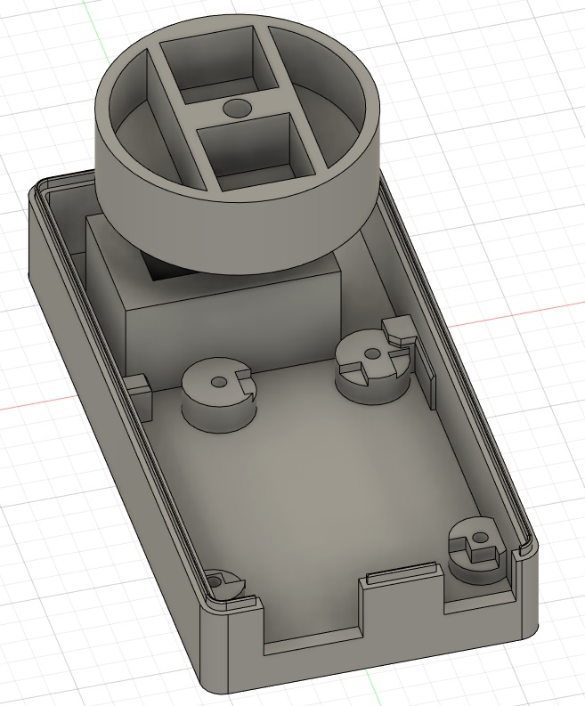
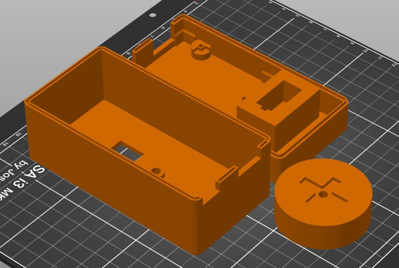
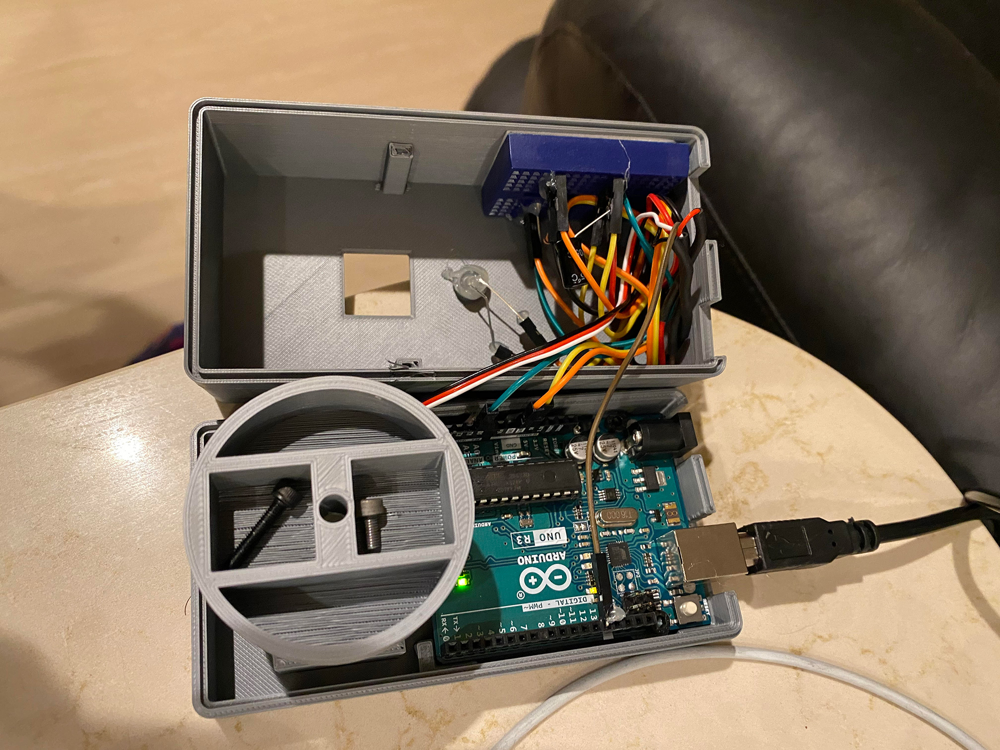

## Magic Box of Transmutation

Example video:
https://www.youtube.com/watch?v=79AKvBjL8Qg

The STEP file is included in case you want to make your own remixes.

Code and files available here:
https://github.com/catid/magic_box

### Additional Parts

It requires the Arduino Starter Kit:
https://www.amazon.com/gp/product/B009UKZV0A/

And a small breadboard:
https://www.amazon.com/gp/product/B07KGQ7H8B/

Some jumper cables are helpful:
https://www.amazon.com/gp/product/B01EV70C78/

### Printing Guide

This has three parts to print: Top, Bottom, and Spinner.  The STL files to import into your slicer are provided.

I'd recommend orienting the parts as shown below on the printer bed so that the quality of the connecting bottom of the spinner is as high as possible:

I used 0.2 mm layer height on a Prusa i3 and had good results.

### Assembly Guide

Insert the servo motor into the housing, pulling the wires through the hole.  Use hot glue all around the housing to rigidly fix the motor in the housing.

Insert the Arduino into the bottom, and screw it in with M3 screws that are 4-6 mm long, or just let it sit on the bottom.

Insert the kit's phototransistor into the 5 mm circular hole in the top, and hot glue it into place from inside the case.

Place the cross-shaped white stepper motor adapter into the bottom of the spinner (it should have a tight fit).  Use the two tiny metal screws in the stepper motor box to screw it into the spinner securely.

The Arduino kit recommends adding a 100 uF capacitor between power and ground due to the motor current draw.  It also needs a 10 kOhm resistor between the photoresistor negative lead and ground.  This stuff is all covered in the Arduino kit book, so glossing over it here.

The code assumes that the photoresistor is connected to A0, and the motor PWM (white) pin is connected to D13.

I kind of just mashed everything into the Arduino side of the case to avoid having the wires rub against the spinner:

### Programming Guide

The source code is under `magic_box.ino`.

Just drop it into the Arduino IDE and upload it.

You probably need to hand-rotate the spinner a bit until its position is aligned with the hole in the top of the case.
